<div style="background-color: #215294; color: white; text-align: center; padding: 20px;">
  <h1>Workshop UI Reference Guide</h1>
</div>

--- 

Welcome to our Flutter UI workshop reference guide! This document compiles the essential Flutter widgets and components we'll be working with throughout the workshop. Each section provides detailed explanations, key parameters, and practical code examples to help you build beautiful and functional Flutter applications.

---
## Table of Content

### 1. Core
| Widget |
|--------|
| [StatelessWidget](#statelesswidget) | 
| [StatefulWidget](#statefulwidget) | 

### 2. Layout
| Widget | Preview |
|--------|---------|
| [Scaffold](#scaffold) | 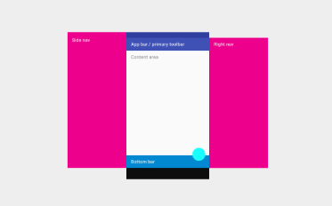|
| [Column](#column) | 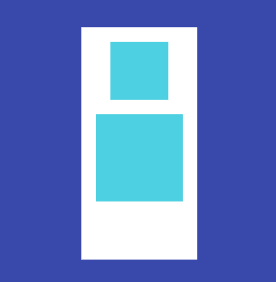 |
| [Row](#row) | 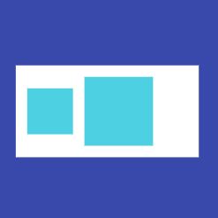 |
| [Stack](#stack) | 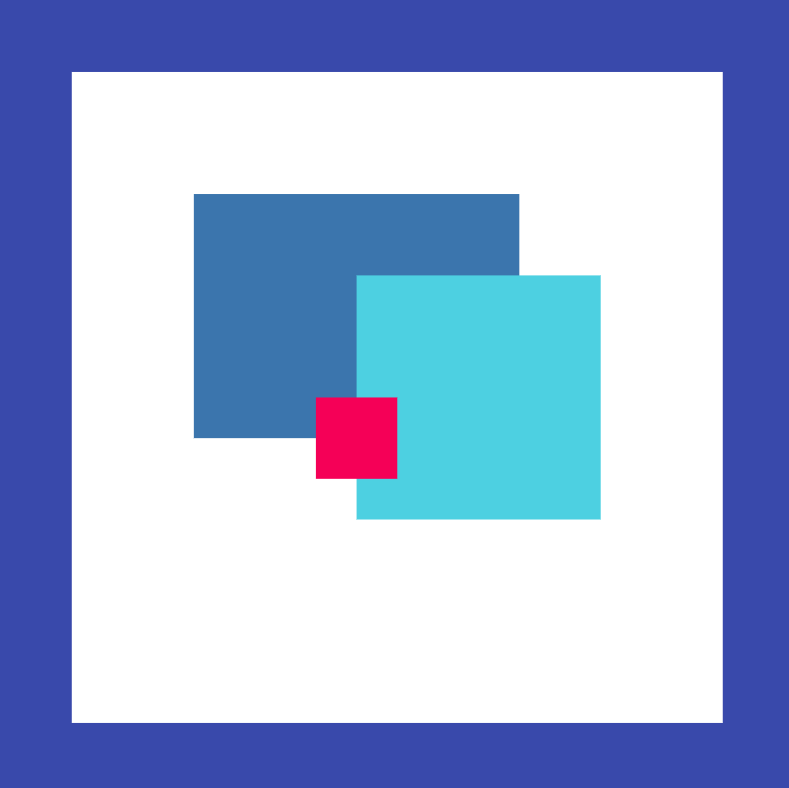 |
| [Wrap](#wrap) |  |

### 3. Basic UI
| Widget | Preview |
|--------|---------|
| [Container](#container) | 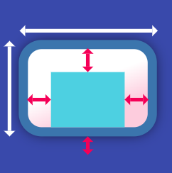 |
| [Card](#card) | 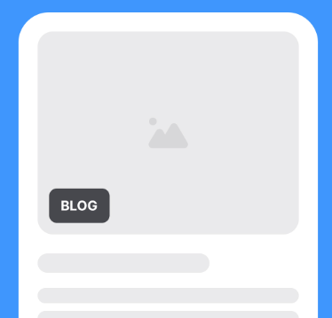 |
| [Text](#text) | 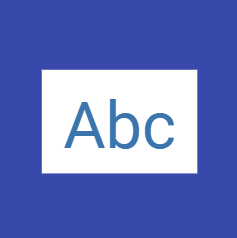 |
| [Image](#image) | 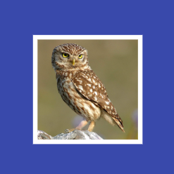 |
| [Buttons](#buttons) | 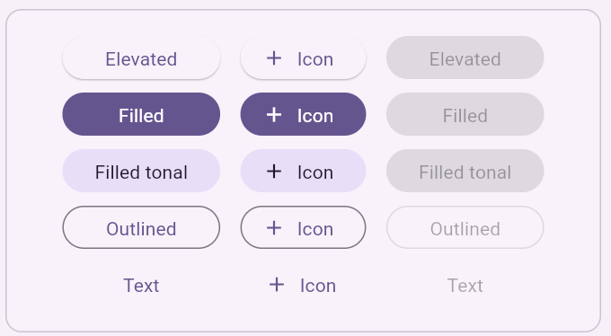 |
| [TextField](#textfield) | 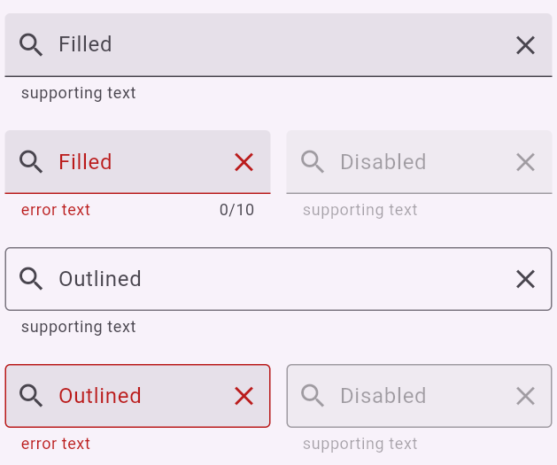 |

### 4. Advanced UI
| Widget | Preview |
|--------|---------|
| [ListView](#listview) |  |
| [StreamBuilder](#streambuilder) |  |
| [FutureBuilder](#futurebuilder) |  |
| [CheckboxListTile](#checkboxlisttile) | 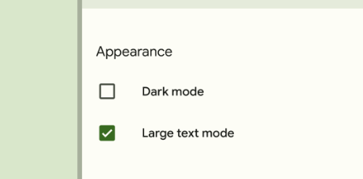 |

### 5. Navigation
| Widget | Preview |
|--------|---------|
| [AppBar](#appbar) | 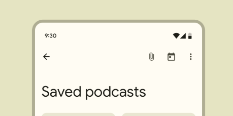 |
| [Drawer](#drawer) | 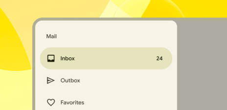 |

---

## 1. Core

### StatelessWidget
- **Introduction**: A widget that doesn’t change over time.
- **Sample Code**:
```dart
class WelcomeScreen extends StatelessWidget {
  final String message;
  
  const WelcomeScreen({Key? key, required this.message}) : super(key: key);
  
  @override
  Widget build(BuildContext context) {
    return Container(
      child: Text(message),
    );
  }
}
```

### StatefulWidget
- **Introduction**: A widget that has mutable state and can change dynamically.
- **Key Parameters**:
  - `State` class with `setState()` method for updating the UI
- **Sample Code**:
```dart
class Counter extends StatefulWidget {
  const Counter({Key? key}) : super(key: key);

  @override
  _CounterState createState() => _CounterState();
}

class _CounterState extends State<Counter> {
  int _count = 0;

  void _increment() {
    // change the state to see the effect of count increase
    setState(() {
      _count++;
    });
  }

  @override
  Widget build(BuildContext context) {
    return Column(
      children: [
        Text('Count: $_count'),
        ElevatedButton(
          onPressed: _increment,
          child: Text('Increment'),
        ),
      ],
    );
  }
}
```
---

## 2. Layout

### Scaffold


- **Introduction**: Implements the basic material design visual layout structure. Provides a framework for implementing the basic material design layout of an application.
- **Key Parameters**:
  - `backgroundColor`: The background of the layout/Page
  - `appBar`: The top AppBar of the screen
  - `body`: The primary content of the scaffold
  - `floatingActionButton`: A floating button anchored to the bottom-right
  - `drawer`: The side menu panel
- **Sample Code**:
```dart
Scaffold(
    background: Colors.blue,
    drawer: drawer(),
    appBar: AppBar(
        title: Text('My App'),
    ),
    body: Center(
        child: Text('Hello World'),
    ),
    floatingActionButton: FloatingActionButton(
        onPressed: () {},
        child: Icon(Icons.add),
    ),
)
```
---

### Column

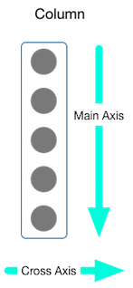

- **Introduction**: A widget that displays its children in a vertical array. Takes up all available vertical space by default.
- **Key Parameters**:
- **Key Parameters**:
    - `mainAxisAlignment`: Vertical alignment of children
        - `MainAxisAlignment.start`: Place children at start
        - `MainAxisAlignment.end`: Place children at end
        - `MainAxisAlignment.center`: Place children at center
        - `MainAxisAlignment.spaceBetween`: Evenly space children with first/last at edges
        - `MainAxisAlignment.spaceAround`: Evenly space children with half-size edge spacing
        - `MainAxisAlignment.spaceEvenly`: Evenly space children including edges
    - `crossAxisAlignment`: Horizontal alignment of children
        - `CrossAxisAlignment.start`: Align children at start of cross axis
        - `CrossAxisAlignment.end`: Align children at end of cross axis
        - `CrossAxisAlignment.center`: Center children along cross axis
        - `CrossAxisAlignment.stretch`: Stretch children across cross axis
        - `CrossAxisAlignment.baseline`: Align children by their baselines
    - `children`: List of widgets to display vertically
    - `mainAxisSize`: How much space to occupy in the main axis
        - `MainAxisSize.max`: Take all available space
        - `MainAxisSize.min`: Take only necessary space
- **Sample Code**:
```dart
Column(
  mainAxisAlignment: MainAxisAlignment.center,
  crossAxisAlignment: CrossAxisAlignment.start,
  children: [
    Text('Item 1'),
    Text('Item 2'),
    Text('Item 3'),
  ],
)
```
---

### Row

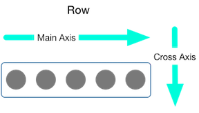

- **Introduction**: A widget that displays its children in a horizontal array. Takes up all available horizontal space by default.
- **Key Parameters**:
    - `mainAxisAlignment`: Horizontal alignment of children
        - `MainAxisAlignment.start`: Place children at start
        - `MainAxisAlignment.end`: Place children at end
        - `MainAxisAlignment.center`: Place children at center
        - `MainAxisAlignment.spaceBetween`: Evenly space children with first/last at edges
        - `MainAxisAlignment.spaceAround`: Evenly space children with half-size edge spacing
        - `MainAxisAlignment.spaceEvenly`: Evenly space children including edges
    - `crossAxisAlignment`: Vertical alignment of children
        - `CrossAxisAlignment.start`: Align children at start of cross axis
        - `CrossAxisAlignment.end`: Align children at end of cross axis
        - `CrossAxisAlignment.center`: Center children along cross axis
        - `CrossAxisAlignment.stretch`: Stretch children across cross axis
        - `CrossAxisAlignment.baseline`: Align children by their baselines
    - `children`: List of widgets to display horizontally
    - `mainAxisSize`: How much space to occupy in the main axis
        - `MainAxisSize.max`: Take all available space
        - `MainAxisSize.min`: Take only necessary space
- **Key Parameters**:
  - `spacing`: Gap between adjacent children in a run
  - `runSpacing`: Gap between runs
  - `direction`: Main axis direction (horizontal or vertical)
- **Sample Code**:
```dart
Wrap(
  spacing: 8.0,
  runSpacing: 4.0,
  children: [
    Chip(label: Text('Tag 1')),
    Chip(label: Text('Tag 2')),
    Chip(label: Text('Tag 3')),
  ],
)
```
---

## 3. Basic UI

### Container

|  |  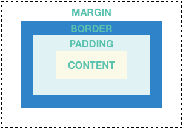 |
|--------------------------------|--------------------------------|

- **Introduction**: A convenience widget that combines common painting, positioning, and sizing widgets.
- **Key Parameters**:
  - `decoration`: BoxDecoration for styling:
      - `boxShadow`: List of box shadows
      - `border`: Border around all sides
      - `borderRadius`: Corner rounding
      - `image`: Background image styling
      - `gradient`: Color gradient settings
      - `shape`: Box shape (rectangle/circle)
      - `color`: Background color
      - `backgroundBlendMode`: How background colors blend
  - `padding`/`margin`: Spacing controls
  - `width`/`height`: Size constraints
- **Sample Code**:
```dart
Container(
  width: 200,
  height: 200,
  margin: EdgeInsets.all(10),
  decoration: BoxDecoration(
    color: Colors.white,
    borderRadius: BorderRadius.circular(10),
    border: Border.all(color: Colors.grey),
    image: DecorationImage(
      image: NetworkImage('url_to_image'),
      fit: BoxFit.cover,
    ),
    gradient: LinearGradient(
      colors: [Colors.blue, Colors.green],
      begin: Alignment.topLeft,
      end: Alignment.bottomRight,
    ),
  ),
  child: Center(child: Text('Hello')),
)
```
---

### Card


- **Introduction**: A material design card with rounded corners and elevation shadow.
- **Key Parameters**:
  - `elevation`: Shadow depth
  - `shape`: Card's shape
  - `color`: Color of card
  - `child`: Widget to display inside the card
- **Sample Code**:
```dart
Card(
  elevation: 4.0,
  color: Colors.white,
  shape: RoundedRectangleBorder(
    borderRadius: BorderRadius.circular(10.0),
  ),
  child: Padding(
    padding: EdgeInsets.all(16.0),
    child: Text('Card Content'),
  ),
)
```
---

### Text


- **Introduction**: A widget that displays a string of text with single style.
- **Key Parameters**:
  - `style`: TextStyle for customizing appearance
  - `textAlign`: Text alignment
  - `overflow`: How to handle text that doesn't fit
- **Sample Code**:
```dart
Text(
  'Styled Text Example',
  style: TextStyle(
    fontSize: 24.0,
    fontWeight: FontWeight.bold,
    color: Colors.blue,
    letterSpacing: 1.2,
    shadows: [
      Shadow(
        color: Colors.grey,
        offset: Offset(2, 2),
        blurRadius: 3,
      ),
    ],
  ),
  textAlign: TextAlign.center,
)
```
---

### Image


- **Introduction**: A widget that displays an image.
- **Different Image Types**:
    1. **AssetImage/Image.asset**:
         - For bundled images in assets
         - Use `Image.asset` for simple, direct image loading
         - Use `AssetImage` when you need to reuse the image in multiple places or need more control over image configuration
         ```dart
         // Using Image.asset - simpler syntax for one-time use
         Image.asset('assets/images/logo.png')
         
         // Using AssetImage - better for reusability and configuration
         Image(image: AssetImage('assets/images/logo.png'))
         ```
    
    2. **NetworkImage/Image.network**:
         - For loading images from URLs
         - Use `Image.network` for quick, one-off network image loading
         - Use `NetworkImage` when you need caching control or want to reuse the image instance
         ```dart
         // Using Image.network - simpler syntax for basic usage
         Image.network('https://example.com/image.jpg')
         
         // Using NetworkImage - better for advanced configuration
         Image(image: NetworkImage('https://example.com/image.jpg'))
         ```

- **Key Parameters**:
  - `fit`: How the image should be inscribed into the space
  - `width`/`height`: Size constraints

- **Sample Code**:
```dart
Image.network(
  'https://example.com/image.jpg',
  fit: BoxFit.cover,
  width: 200,
  height: 200,
  loadingBuilder: (context, child, progress) {
    return progress == null
        ? child
        : CircularProgressIndicator();
  },
)
```
---

### Buttons


- **Introduction**: Various types of material design buttons.
- **Key Parameters**:
  - `onPressed`: Callback when button is pressed
  - `child`: Widget to display inside button
  - `style`: ButtonStyle for customizing appearance
- **Sample Code**:
```dart
Column(
  children: [
    ElevatedButton(
        style: ElevatedButton.styleFrom(
          backgroundColor: Color(0xff0553B1),
        ),
        onPressed: () {},
        child: Text('Elevated Button'),
    ),
    IconButton(
        icon: Icon(Icons.favorite),
        onPressed: () {},
    ),
    TextButton(
        onPressed: () {},
        child: Text('Text Button'),
    ),
  ],
)
```
---

### TextField


- **Introduction**: A material design text field for user input.
- **Key Parameters**:
  - `controller`: TextEditingController for managing text
  - `decoration`: InputDecoration for styling:
      - `labelText`: Text displayed above the field when focused
      - `hintText`: Placeholder text shown when field is empty
      - `prefixIcon`/`suffixIcon`: Icons at start/end of field
      - `border`: Border styling (OutlineInputBorder, UnderlineInputBorder)
      - `errorText`: Text shown when validation fails
      - `filled`: Whether to fill the field background
      - `fillColor`: Color used when filled is true
  - `onChanged`: Callback when text changes
- **Sample Code**:
```dart
TextField(
  controller: TextEditingController(),
  decoration: InputDecoration(
    labelText: 'Username',
    hintText: 'Enter your username',
    prefixIcon: Icon(Icons.person),
    border: OutlineInputBorder(),
  ),
  onChanged: (value) {
    print('Current value: $value');
  },
)
```

## 4. Advanced UI

### ListView


- **Introduction**: A scrollable list of widgets arranged linearly.
- **Key Parameters**:
  - `children`: List of widgets for ListView
  - `itemBuilder`: Function to build items for ListView.builder
  - `itemCount`: Number of items in ListView.builder
- **Sample Code**:
```dart
// ListView.builder example
ListView.builder(
  itemCount: 100,
  itemBuilder: (context, index) {
    return ListTile(
      leading: Icon(Icons.star),
      title: Text('Item $index'),
      subtitle: Text('Description for item $index'),
      trailing: Icon(Icons.arrow_forward_ios),
      onTap: () {},
    );
  },
)
```
---

### StreamBuilder
- **Introduction**: Widget that builds itself based on the latest snapshot of interaction with a Stream.
- **Key Parameters**:
  - `stream`: The stream to listen to
  - `builder`: Function to build UI based on stream data
- **Sample Code**:
```dart
StreamBuilder<int>(
  stream: countStream,
  builder: (context, snapshot) {
    if (snapshot.hasError) {
      return Text('Error: ${snapshot.error}');
    }
    if (snapshot.hasData) {
      return Text('Count: ${snapshot.data}');
    }
    return CircularProgressIndicator();
  },
)
```
---

### FutureBuilder
- **Introduction**: Widget that builds itself based on the latest snapshot of interaction with a Future.
- **Key Parameters**:
  - `future`: The future to wait for
  - `builder`: Function to build UI based on future result
- **Sample Code**:
```dart
FutureBuilder<String>(
  future: fetchData(),
  builder: (context, snapshot) {
    if (snapshot.hasData) {
      return Text(snapshot.data!);
    } else if (snapshot.hasError) {
      return Text('Error: ${snapshot.error}');
    }
    return CircularProgressIndicator();
  },
)
```
---

### CheckboxListTile


- **Introduction**: A ListTile with a checkbox, combining the functionality of Checkbox and ListTile.
- **Key Parameters**:
  - `value`: Current checkbox state
  - `onChanged`: Callback when checkbox is toggled
  - `title`: Primary content of the list tile
- **Sample Code**:
```dart
CheckboxListTile(
  title: Text('Enable notifications'),
  subtitle: Text('Receive push notifications'),
  value: true,
  onChanged: (bool? value) {},
  secondary: Icon(Icons.notifications),
)
```
---

## 5. Navigation

### AppBar


- **Introduction**: A material design app bar that can contain a toolbar, leading/trailing widgets, and flexible space.
- **Key Parameters**:
  - `title`: Primary widget displayed in the app bar
  - `leading`: Widget displayed before the title
  - `actions`: List of widgets after the title
- **Sample Code**:
```dart
AppBar(
  leading: IconButton(
    icon: Icon(Icons.menu),
    onPressed: () {},
  ),
  title: Text('My App'),
  actions: [
    IconButton(
      icon: Icon(Icons.search),
      onPressed: () {},
    ),
    IconButton(
      icon: Icon(Icons.more_vert),
      onPressed: () {},
    ),
  ],
)
```
---

### Drawer


- **Introduction**: A material design panel that slides in horizontally from the edge of a Scaffold.
- **Key Parameters**:
  - `child`: Widget to display in the drawer
  - `elevation`: Shadow depth of the drawer
- **Sample Code**:
```dart
Drawer(
  child: ListView(
    padding: EdgeInsets.zero,
    children: [
      DrawerHeader(
        decoration: BoxDecoration(
          color: Colors.blue,
        ),
        child: Text('App Name'),
      ),
      ListTile(
        leading: Icon(Icons.home),
        title: Text('Home'),
        onTap: () {},
      ),
      ListTile(
        leading: Icon(Icons.settings),
        title: Text('Settings'),
        onTap: () {},
      ),
    ],
  ),
)
```